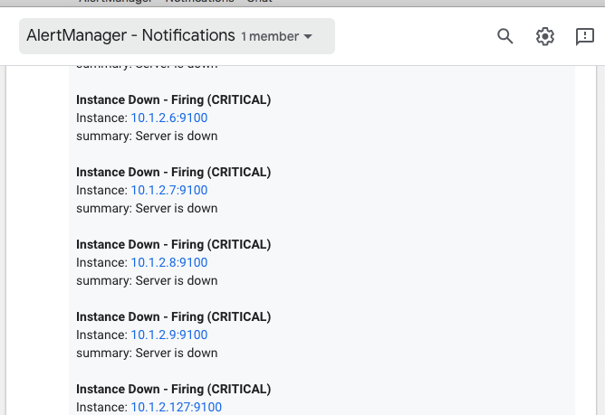

# calert


## Overview [](https://godoc.org/github.com/mr-karan/calert) [](https://goreportcard.com/report/github.com/mr-karan/calert)

[](https://github.com/mr-karan/calert/releases/)

`calert` is a lightweight binary to push [Alertmanager](https://github.com/prometheus/alertmanager) notifications to [Google Chat](http://chat.google.com) via webhook integration.

## Table of Contents

-   [Getting Started](#getting-started-quickstart)

    -   [How it Works](#how-it-works)
    -   [Installation](#installation)
    -   [Quickstart](#quickstart)
    -   [Testing a sample alert](#testing-a-sample-alert)

-   [Advanced Section](#advanced-section)

    -   [Configuration options](#configuation-options)
    -   [API Usage](#api-usage)
    -   [Setting up Prometheus](#setting-up-prometheus)

-   [Ansible Playbook](#ansible-playbook) <_Coming Soon_>

## Getting Started (Quickstart)

### How it Works


`calert` uses Alertmanager [webhook receiver](https://prometheus.io/docs/alerting/configuration/#webhook_config) to receive alerts payload, and pushes this data to Google Chat [webhook](https://developers.google.com/hangouts/chat/how-tos/webhooks) endpoint.

### Installation

There are two ways of installing calert.

-   ### Precompiled binaries

    Precompiled binaries for released versions are available in the [_Releases_ section](https://github.com/mr-karan/calert/releases/).

-   ### Compiling the binary

    You can checkout the source code and build manually:

    ```
    $ mkdir -p $GOPATH/src/github.com/mr-karan/
    $ cd $GOPATH/src/github.com/mr-karan
    $ git clone https://github.com/mr-karan/calert.git
    $ cd calert
    $ make build
    $ cp config.toml.sample config.toml
    $ ./calert
    ```

### Quickstart

```sh
mkdir calert-example && cd calert-example/ # copy the binary and config.toml.sample in this folder
cp config.toml.sample config.toml # change the settings like hostname, address, google chat webhook url, timeouts etc in this file.
./calert.bin # this command starts a web server (calert API) and is ready to receive events from alertmanager
```

-   Set the webhook URL from Google Chat in `[app.chat.<yourRoomName>.notification_url]` section of `config.toml`. You can refer to the [official documentation](https://developers.google.com/hangouts/chat/quickstart/incoming-bot-python#step_1_register_the_incoming_webhook) for more details.

You are now ready to send alerts to Google Chat!

### Testing a sample alert

To help you quickly get started, you can `POST` a dummy payload which is similar to `Alertmanager` payload, present in [examples/send_alert.sh](examples/send_alert.sh).



## Advanced Section

### Configuration Options

-   **[server]**

    -   **address**: Port which the server listens to.
    -   **socket**: _Optional_, if you want to connect to the server using unix socket.
    -   **name**: _Optional_, human identifier for the server.
    -   **read_timeout**: Duration (in milliseconds) for the request body to be fully read) Read this [blog](https://blog.cloudflare.com/the-complete-guide-to-golang-net-http-timeouts/) for more info.
    -   **write_timeout**: Duration (in milliseconds) for the response body to be written.
    -   **keepalive_timeout**: Duration (in milliseconds) the server waits for the connection to be re-used in case the request is sent with Keep-Alive header.

-   **[app]**

    -   **template_file**: Path to template file used for parsing Alertmanager payload to Google Chat message. You can configure the default template for notification and create your own. Create a [template](https://golang.org/pkg/text/template/) file, similar to [message.tmpl](message.tmpl) and set the path of this file in this setting.
    -   **http_client**
        -   **max_idle_conns**: _Optional_, human identifier for the server.
        -   **request_timeout**: Duration (in milliseconds) to wait for the response.
    -   **chat.your_room_name**
        -   **notification_url**: Webhook URL of Google Chat Room where Incoming Webhooks are configured.

**NOTE**: You can use `--config.file` parameter to supply a custom config file path while running `calert`.

### API Usage

-   POST `/create?room_name=<>` (Used to receive new alerts and push to Google Chat.)

```sh
# example request. (See examples/send_alert.sh)
➜ curl -XPOST -d"$alerts1" http://localhost:6000/create?room_name=<room> -i
{"status":"success","message":"Alert sent","data":null}
```

_`room_name`_ param is required. The same `room_name` should be present in `app.chat` section. You can refer to the `config.sample` for examples.

-   GET `/ping` (Health check endpoint)

```sh
➜ curl http://localhost:6000/ping
{"status":"success","data":{"buildVersion":"025a3a3 (2018-12-26 22:04:46 +0530)","buildDate":"2018-12-27 10:41:52","ping":"pong"}}
```

### Setting Up Prometheus

-   Alertmanager has the ability of group similar alerts together and fire only one event, clubbing all the alerts data into one event. `calert` leverages this and sends all alerts in one message by looping over the alerts and passing data in the template. You can configure the rules for grouping the alerts in `alertmanager.yml` config. You can read more about it [here](https://github.com/prometheus/docs/blob/master/content/docs/alerting/alertmanager.md#grouping).

*   Configure Alertmanager config file (`alertmanager.yml`) and give the address of calert web-server. You can refer to the [official documentation](https://prometheus.io/docs/alerting/configuration/#webhook_config) for more details.

## Contribution

PRs on Feature Requests, Bug fixes are welcome. Feel free to open an issue and have a discussion first. Read [CONTRIBUTING.md](CONTRIBUTING.md) for more details.

## License

[MIT](license)
