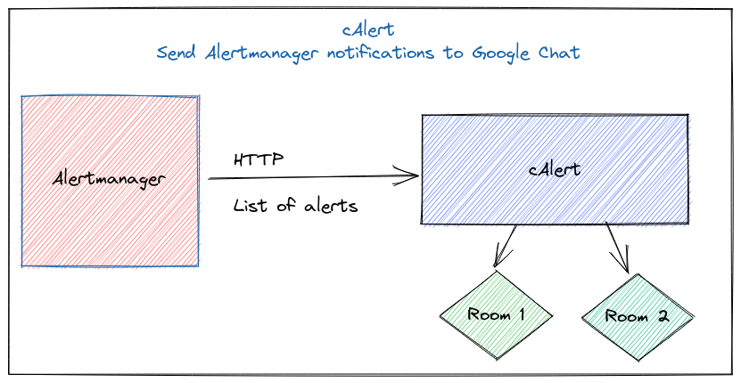

<a href="https://zerodha.tech"></a>

# calert

_Send Alertmanager notifications to Google Chat (and more!)_



`calert` uses Alertmanager [webhook receiver](https://prometheus.io/docs/alerting/configuration/#webhook_config) to receive alerts payload, and pushes this data to Google Chat [webhook](https://developers.google.com/hangouts/chat/how-tos/webhooks) endpoint.

## Quickstart

### Binary

Grab the latest release from [Releases](https://github.com/mr-karan/calert/releases).

To run:

```sh
./calert.bin --config config.toml
```

### Docker

You can find the list of docker images [here](https://github.com/mr-karan/calert/pkgs/container/calert)

```
docker pull ghcr.io/mr-karan/calert:latest
```

Here's an example `docker-compose` config with a custom `message.tmpl` mounted inside the container:

```yml
  calert:
    image: ghcr.io/mr-karan/calert:latest
    ports:
      - "6000:6000"
    volumes:
      - ./message.tmpl:/etc/calert/message.tmpl
```

### Configuration

Refer to [config.sample.toml](./config.sample.toml) for instructions on how to configure `calert`.

All the config variables can also be supplied as Environment Variables by prefixing `CALERT_` and replacing `.` (_period_) with `__` (_double underscores_).

Example:

- `app.address` would become `CALERT_APP__ADDRESS`

#### App

|  Key  	|  Explanation 	| Default 	|
|---	| ---	| --- |
|  `app.address` 	| Address of the HTTP Server. 	| `0.0.0.0:6000`	|
|  `app.server_timeout` 	| Server timeout for HTTP requests.  	| `5s` |
|  `app.enable_request_logs` 	| Enable HTTP request logging.  	| `true` |
|  `app.log` 	| Use `debug` to enable verbose logging. Can be set to `info` otherwise.  	| `info` |


#### Providers

`calert` can load a map of different _providers_. The unique identifier for the `provider` is the room name. Each provider has it's own configuration, based on it's `provider_type. Currently `calert` supports Google Chat but can support arbitary providers as well.

|  Key  	|  Explanation 	| Default 	|
|---	| ---	| --- |
|  `providers.<room_name>.type` 	| Provider type. Currently only `google_chat` is supported. 	| `google_chat`	|
|  `providers.<room_name>.endpoint` 	| Webhook URL to send alerts to.  	| - |
|  `providers.<room_name>.max_idle_conns` 	| Maximum Keep Alive connections to keep in the pool.  	| `50` |
|  `providers.<room_name>.timeout` 	| Timeout for making HTTP requests to the webhook URL.  	| `7s` |
|  `providers.<room_name>.template` 	| Template for rendering a formatted Alert notification.  	| `static/message.tmpl` |
|  `providers.<room_name>.thread_ttl` 	| Timeout to keep active alerts in memory. Once this TTL expires, a new thread will be created.	| `12h` |

## Alertmanager Integration

-   Alertmanager has the ability of group similar alerts together and fire only one event, clubbing all the alerts data into one event. `calert` leverages this and sends all alerts in one message by looping over the alerts and passing data in the template. You can configure the rules for grouping the alerts in `alertmanager.yml` config. You can read more about it [here](https://github.com/prometheus/docs/blob/master/content/docs/alerting/alertmanager.md#grouping).

- Configure Alertmanager config file (`alertmanager.yml`) and give the address of calert web-server. You can refer to the [official documentation](https://prometheus.io/docs/alerting/configuration/#webhook_config) for more details.

You can refer to the following config block to route webhook alerts to `calert`:

```yml
route:
    receiver: 'calert'
    group_wait: 30s
    group_interval: 60s
    repeat_interval: 15m
    group_by: ['room', 'alertName']

receivers:
    - name: 'calert'
      webhook_configs:
      - url: 'http://calert:6000/dispatch'
```

## Threading Support in Google Chat

`calert` ships with a basic support for sending multiple related alerts under a same thread, working around the limitations by Alertmanager.

Alertmanager currently doesn't send any _Unique Identifier_ for each Alert. The use-case of sending related alerts under the same thread is helpful to triage similar alerts and see all their different states (_Firing_, _Resolved_) for people consuming these alerts. `calert` tries to solve this by:

- Use the `fingerprint` field present in the Alert. This field is computed by hashing the labels for an alert.
- Create a map of `active_alerts` in memory. Add an alert by it's fingerprint and generate a random `UUID.v4` and store that in the map (along with some more meta-data like `startAt` field).
- Use `?threadKey=uuid` query param while making a request to Google Chat. This ensures that all alerts with same fingerprint (=_same labels_) go under the same thread.
- A background worker runs _every hour_ which scans the map of `active_alerts`. It checks whether the alert's `startAt` field has crossed the TTL (as specified by `thread_ttl`). If the TTL is expired then the `alert` is removed from the map. This ensures that the map of `active_alerts` doesn't grow unbounded and after a certain TTL all alerts are sent to a new thread.

## Prometheus Metrics

`calert` exposes various metrics in the Prometheus exposition format.

Here's a list of internal app metrics available at `/metrics`:

|  Name  	|  Description 	| Data type 	|
|---	| ---	| --- |
|  `calert_uptime_seconds` 	| Uptime of app (_in seconds_). 	| `counter`	|
|  `calert_start_timestamp` 	| UNIX timestamp since the app was booted.  	| `gauge` |
|  `calert_http_requests_total` 	| Number of HTTP requests, grouped with labels like `handler`.  	| `counter` |
|  `calert_http_request_duration_seconds_{sum,count,bucket}` 	| Duration of HTTP request (_in seconds_).  	| `histogram` |
|  `calert_alerts_dispatched_total` 	| Number of alerts dispatched to upstream providers, grouped with labels like `provider` and `room`.  	| `counter` |
|  `calert_alerts_dispatched_duration_seconds_{sum,count,bucket}` 	| Duration to send an alert to upstream provider.	| `histogram` |

It also exposes Go process metrics in addition to app metrics, which you can use to monitor the performance of `calert`.

## Migrating from v1 to v2

A few notes on `v2` migration:

### Config schema changes

`v2` is a complete rewrite from scratch and **is a breaking release**. The configuration has changed extensively. Please refer to latest [`config.sample.toml`](config.sample.toml) for a complete working example of the config.

### Dry Run Mode

In case you're simply experimenting with `calert` config changes and you don't wish to send _actual_ notifications, you can set `dry_run=true` in each provider.

### Room Name for Google Chat

Apart from the config, `calert` now determines the `room` based on the `receiver` specified in Alertmanager config. Previously, the room was identified with `?room` query parameter in each HTTP request. However, since the Alert payload contains the `receiver` name, it's better to extract this information from the labels instead.

Here's an example of how Alertmanager config looks like. Notice the value of `receiver` (`prod_alerts`) should match one of `provider.<room_name>` (eg `provider.prod_alerts`) in your `config.toml`):

```yml
receivers:
    - name: 'prod_alerts'
      webhook_configs:
      - url: 'http://calert:6000/dispatch'
```

## Contribution

PRs on Feature Requests, Bug fixes are welcome. Feel free to open an issue and have a discussion first.

For deployment manifests like Helm, Kustomize, Nomad etc - they're placed under `contrib` folder and generally manintained by the community.

## License

[LICENSE](LICENSE)
